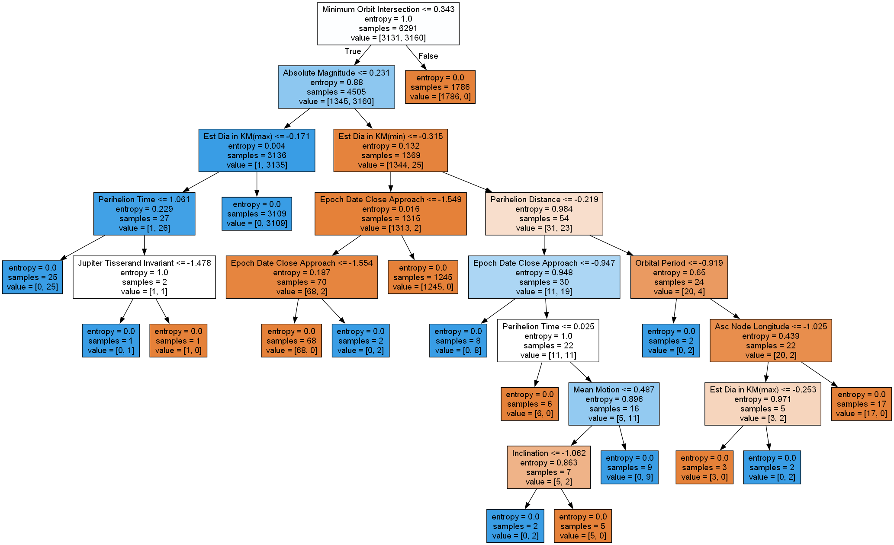
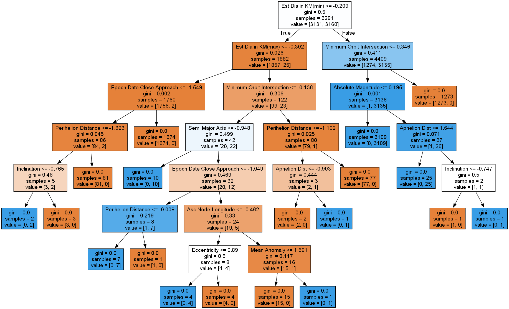

# Asteroid Hazard Classification

## Overview
This project focuses on predicting asteroid hazard using classification analysis. The dataset comprises various features related to asteroid characteristics and close approaches to Earth. By analyzing these features, I aim to develop a model that can accurately classify asteroids as hazardous or non-hazardous, which is crucial for identifying potential threats to Earth.

## Dataset
The dataset used for this analysis contains the following columns:

- `Neo Reference ID`
- `Name`
- `Absolute Magnitude`
- `Est Dia in KM(min)`
- `Est Dia in KM(max)`
- `Est Dia in M(min)`
- `Est Dia in M(max)`
- `Est Dia in Miles(min)`
- `Est Dia in Miles(max)`
- `Est Dia in Feet(min)`
- `Est Dia in Feet(max)`
- `Close Approach Date`
- `Epoch Date Close Approach`
- `Relative Velocity km per sec`
- `Relative Velocity km per hr`
- `Miles per hour`
- `Miss Dist.(Astronomical)`
- `Miss Dist.(lunar)`
- `Miss Dist.(kilometers)`
- `Miss Dist.(miles)`
- `Orbiting Body`
- `Orbit ID`
- `Orbit Determination Date`
- `Orbit Uncertainty`
- `Minimum Orbit Intersection`
- `Jupiter Tisserand Invariant`
- `Epoch Osculation`
- `Eccentricity`
- `Semi Major Axis`
- `Inclination`
- `Asc Node Longitude`
- `Orbital Period`
- `Perihelion Distance`
- `Perihelion Arg`
- `Aphelion Dist`
- `Perihelion Time`
- `Mean Anomaly`
- `Mean Motion`
- `Equinox`
- `Hazardous`

## Preprocessing Tasks
Before performing classification, several preprocessing tasks were performed:

- Dropping unwanted columns based on correlation
- Performing One Hot Encoding on the dependent feature (`Hazardous`) to numeric values
- Detecting and removing outliers using Inter-Quartile-Range
- Normalizing skewed features
- Resolving class imbalance
- Normalizing features using standard scaling before splitting the data into training and testing datasets.

## Models Used
Classification was performed using the following models:

1. **Decision Tree with Hyperparameter Tuning**: Decision trees were employed with hyperparameter tuning to optimize model performance.
2. **Neural Network**: A neural network model was utilized for classification, leveraging its ability to capture complex relationships in the data.

## Decision Tree Images

  

    
    
Before Pruning

  

  

    
    
After Pruning

  

## Tools Used
- Python
- Jupyter Notebook
- Libraries: Pandas, NumPy, Scikit-learn, Matplotlib, Seaborn, TensorFlow/Keras (for neural network)

## Repository Structure
- `data/`: Contains the dataset used for analysis.
- `decision-tree/`: Generated Decision Trees.
- `models/`: Saved model files.
- `Asteroids-Hazard-Classification.ipynb`: Jupyter notebook detailing the analysis process.
- `README.md`: Overview of the project and instructions for replication.

## Usage
To replicate the analysis and predictions:

1. Clone this repository to your local machine.
2. Open the Jupyter notebooks and follow the analysis steps.
3. For prediction, load the trained model and input new data for classification.

## Contributions
Contributions to improve the analysis, model performance, or any related aspect are welcome. Fork this repository, make your changes, and submit a pull request.

## Credits
- Dataset Source: [NASA Planetary Data System](https://pds.nasa.gov/)
- This project was developed by [Tapaswi Satyapanthi](https://www.linkedin.com/in/tapaswi-v-s/).

## License
This project is licensed under the [MIT License](LICENSE.txt).

You are free to:
- Use the code for any purpose, including commercial purposes.
- Modify the code.
- Distribute the code.
- Sublicense the code.

Under the following terms:
- The code comes with no warranty or guarantee.
- You must include a copy of the license in any redistribution.
- You must provide appropriate credit to the original author (you).

