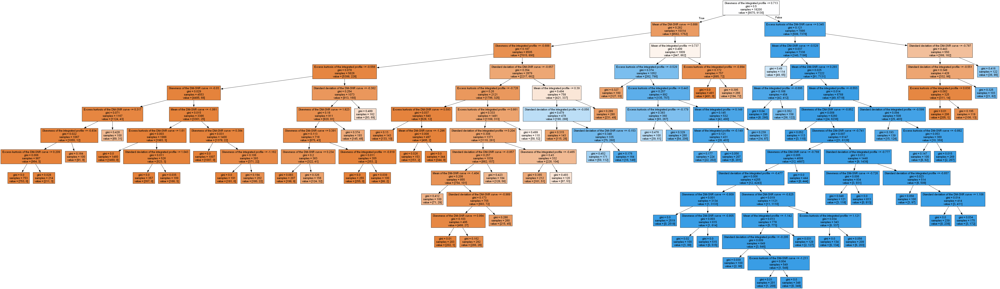

# Pulsar Star Classification

## Overview
This project focuses on classifying Pulsar Stars using classification techniques. Pulsars are highly magnetized, rotating neutron stars that emit beams of electromagnetic radiation. Detecting and classifying pulsars is crucial for understanding various astrophysical phenomena. The dataset comprises features derived from the integrated profile and DM-SNR curve of pulsar candidates. By analyzing these features, I aim to develop models that can accurately classify pulsar stars.

## Dataset
The dataset used for this analysis contains the following columns:

0. Mean of the integrated profile
1. Standard deviation of the integrated profile
2. Excess kurtosis of the integrated profile
3. Skewness of the integrated profile
4. Mean of the DM-SNR curve
5. Standard deviation of the DM-SNR curve
6. Excess kurtosis of the DM-SNR curve
7. Skewness of the DM-SNR curve
8. target_class (class label: 0 for non-pulsar stars, 1 for pulsar stars)

## Preprocessing Tasks
Before performing classification, several preprocessing tasks were performed:

- Treating null values by imputing with the median
- Detecting and removing outliers using Inter-Quartile-Range
- Removed class imbalance using SMOTE
- Normalized the data using StandardScaler()

## Models Used
Classification was performed using the following models:

1. **Decision Tree with Hyperparameter Tuning**: Decision trees were employed with hyperparameter tuning to optimize model performance.
2. **Neural Network**: A neural network model was utilized for classification, leveraging its ability to capture complex relationships in the data.

## Decision Tree Images

  

    
    
Before Pruning

  

  

    
    
After Pruning

  

## Tools Used
- Python
- Jupyter Notebook
- Libraries: Pandas, NumPy, Scikit-learn, Matplotlib, Seaborn, TensorFlow/Keras (for neural network)

## Repository Structure
- `data/`: Contains the dataset used for analysis.
- `decision-tree/`: Generated Decision Trees.
- `models/`: Saved model files.
- `Pulsar-Star-Classification.ipynb`: Jupyter notebook detailing the analysis process.
- `README.md`: Overview of the project and instructions for replication.

## Usage
To replicate the analysis and predictions:

1. Clone this repository to your local machine.
2. Open the Jupyter notebooks and follow the analysis steps.
3. For prediction, load the trained model and input new data for classification.

## Contributions
Contributions to improve the analysis, model performance, or any related aspect are welcome. Fork this repository, make your changes, and submit a pull request.

## Credits
- Dataset Source: [UCI Machine Learning Repository](https://archive.ics.uci.edu/ml/datasets/HTRU2)
- This project was developed by [Tapaswi Satyapanthi](https://www.linkedin.com/in/tapaswi-v-s/).

## License
This project is licensed under the [MIT License](LICENSE.txt).

You are free to:
- Use the code for any purpose, including commercial purposes.
- Modify the code.
- Distribute the code.
- Sublicense the code.

Under the following terms:
- The code comes with no warranty or guarantee.
- You must include a copy of the license in any redistribution.
- You must provide appropriate credit to the original author (you).
